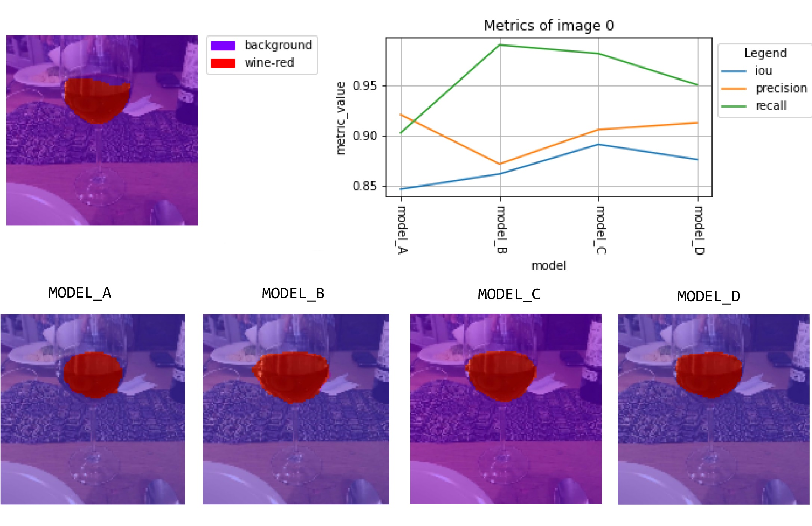
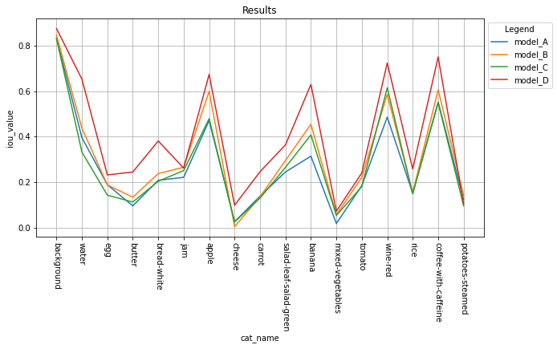

# :pizza: Food Recognition :poultry_leg:

This repository contains a project realized as part of the *Deep Learning* exam of the [Master's degree in Artificial Intelligence, University of Bologna](https://corsi.unibo.it/2cycle/artificial-intelligence).

The *Food Recognition* challenge is a competition hosted by [AIcrowd](https://www.aicrowd.com/challenges/food-recognition-challenge), where participants should deal with an image segmentation problem aiming to recognize individual food items in each image.

The **goal** of this challenge is to train models which can look at images of food items and detect the individual food items present in them.

## Repository structure

    .
    ├── assets 
    │   └── imgs                       # Images used in the report
    ├── report                         # Documentation of the project in pdf format
    ├── data                           # Dataset used for training, validation and testing
    │   ├── train 
    │   ├── val 
    │   └── test
    ├── src                            # Source files 
    │   ├── test_scripts               # Test files used to verify the correctness of custom functions
    │   ├── utils 
    │   │   └── segmentation_utils.py  # Utility functions used into notebooks
    │   ├── models                     # Contains the notebooks used for the training of each model
    │   │   ├── model_A 
    │   │   ├── model_B 
    │   │   ├── model_C
    │   │   └── model_D
    │   └── EvalFoodRecognition.ipynb  # Notebook used for the evaluation of all models            
    │
    ├── LICENSE
    └── README.md

## Prerequisites
It is needed to install *pycocotools* to execute the notebooks.
You can get it from `pip` or from the original [repo](https://github.com/cocodataset/cocoapi) 
To **install on Windows**, you can use [Anaconda environment](https://www.anaconda.com/products/individual) and you must have the [Visual C++ 2015 build tools](https://go.microsoft.com/fwlink/?LinkId=691126):
1. Clone the repo
2. Create a new environment: `conda create -n deep`
3. Activate the environment: `activate deep`
4. Install requirements:  `pip install -r requirements.txt`
5. inside PythonAPI folder, we can find `setup.py` file. Open the file and delete the following line:
    ```python
    extra_compile_args=[‘-Wno-cpp’, ‘-Wno-unused-function’, ‘-std=c99’]
    ```
6. run command `python setup.py build_ext install`
7. run command `python setup.py build_ext --inplace`

## Dataset

The dataset for the [AIcrowd Food Recognition Challenge](https://www.aicrowd.com/challenges/food-recognition-challenge) is available at https://www.aicrowd.com/challenges/food-recognition-challenge/dataset_files

This dataset contains :

- train-v0.4.tar.gz : This is the Training Set of 24120 (as RGB images) food images, along with their corresponding 39328 annotations in [MS-COCO format](http://cocodataset.org/#home)
- val-v0.4.tar.gz: This is the suggested Validation Set of 1269 (as RGB images) food images, along with their corresponding 2053 annotations in [MS-COCO format](http://cocodataset.org/#home)
- test_images-v0.4.tar.gz : This is the debug Test Set for Round-3, where you are provided the same images as the validation set.


## Evaluation Criteria

In order to evaluate results produced by different models there were used three metrics: 
- *IoU (Intersection Over Union)*
- *Precision*
- *Recall*




## Results

For same categories the accuracy of the prediction is very high, instead other categories seems to be very hard to recognize. 



## Resources & Libraries

* pycocotools [API](https://github.com/cocodataset/cocoapi)
* Tensorflow + Keras


## Versioning

We use Git for versioning.


## Group members

| Reg No. |   Name    |  Surname  |                 Email                  |                       Username                        |
| :-----: | :-------: | :-------: | :------------------------------------: | :---------------------------------------------------: |
| 997317  | Giuseppe  |   Murro   |    `giuseppe.murro@studio.unibo.it`    |         [_gmurro_](https://github.com/gmurro)         |
| 985203  | Salvatore | Pisciotta | `salvatore.pisciotta2@studio.unibo.it` | [_SalvoPisciotta_](https://github.com/SalvoPisciotta) |


## License

This project is licensed under the MIT License - see the [LICENSE](LICENSE) file for details